# NgRx
Every Angular application needs to manage state. As an application gets larger, it must manage more and more state. Keeping track of that state can be challenging, especially as more components must react to state changes. We often end up with fragile interactions and hard to find bugs, making it difficult to add more features and more state.

## What is state?
<p align="center">
  
</p>

## Purpose of NgRx
The purpose of NgRx is to provide a formal pattern for organizing our application's state into one single, local state container, managing that state by requiring a one-way data flow, and communicating state changes to our components so they can react accordingly.

## What is NgRx?
NgRx is the popular state management pattern called Redux tailored to Angular using standard Angular concepts and techniques.
<p align="center">
  
</p>

## Why use NgRx?
With NgRx we don't need a service for each bit of state, rather we have a single store for our application state, making it easy to find, track, and retrieve state values.

## Use NgRx when...
### There is lots of state and little services.
The store provides a convenient place to put UI state to retain it between router views.
### There are excessive HTTP requests.
The store provides a client-side cache our application can use as needed.
### There are complex component interactions.
The reducer updates the store and the store notifies all subscribers, keeping the components decoupled, yet communicating. Using NRx in this scenario can prevent race conditions and issues caused when multiple components are updating data.
### Something isn't working
It has great tooling to help us see our actions and state. Using NgRx gives us a standard pattern that can help large or complex projects and larger teams with these issues. But NgRx is not for every project.

## Don't use NgRx when...
* Your team are new to Angular, wrap up with Angular and RxJS Observables first. You'll be much more successful with NgRx once you've mastered Angular.
* If the application is simple, the extra code required for NgRx may not be worth the effort for a simple application.
* If you and your team already have a good state management pattern in place for your applications.

## The Redux Pattern
 Patterns bring order to chaos, and the Redux pattern is no different. Redux is a way to implement a predictable state container for JavaScript apps. Redux the library, which was the first to implement the Redux pattern, was based on Facebook's Flux library, and in the last few years has become the dominant state management pattern for single-page applications. The Redux pattern, which NgRx is based on, has three main principles.

 > There is only one single source of truth for application state called the store.

 > State is ready-only and the only way to change state is to dispatch an action.

 > Changes to the store are made using pure functions called reducers.

### Store
The store is literally a JavaScript object that holds all of your application state. You can think of it as a client-side database. With Angular, you may be building services to hold your application state. Following the Redux pattern, all of this state instead is retained in the store. This becomes very powerful when it comes to reasoning about user interaction, debugging, performances, and avoiding race conditions in general. The store is runtime only, so the state is not retained if the user refreshes the page or after the user exits the application.

The state is much easier to manage if it is arranged into a logical structure. Because Angular applications are often organized into feature modules, it makes sense to layout the state by feature as well. This creates a tree-like hierarchy of properties. Each feature state is added to the application state once the feature is loaded, resulting in a single state tree. These pieces of state are sometimes called slices. So we have the products slice, users slice, and so on.
<p align="center">
  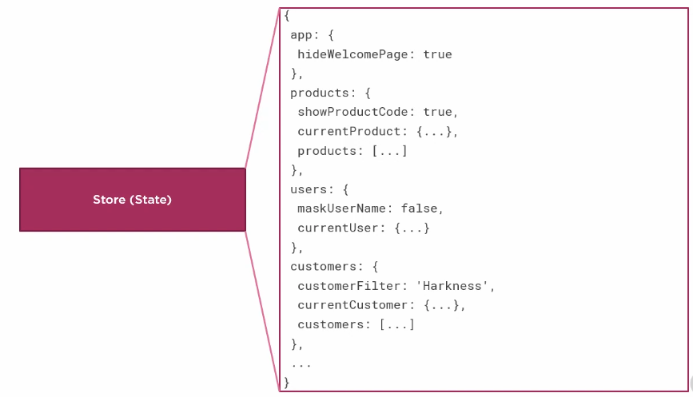
</p>

#### Do you have to put every piece of state in the store? What shouldn't go in the store?
* Unshared state that is solely owned by a single component that does not need to be shared or made available across routes.
* Angular forms also don't belong in the store as they are usually self contained and do not need to be shared across multiple components. Also, Angular forms are not serializable or immutable and can change themselves, meaning you will not be able to track those changes with actions, which is the second principle of Redux, that to change state you need to dispatch actions.
* State that has cycles in it or has complex data structures that cannot be serialized should not be put into the store.

#### Tips
* We have one store for all of the state.
* We'll organize our state by feature to match with our feature modules. To create this state, we define multiple reducers, one for each feature's slice of state.
* State is never created for a module that is not loaded.
<p align="center">
  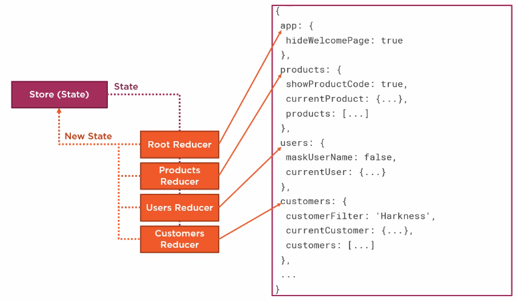
</p>

#### Feature Module State Composition
This allows us to compose our application state from our feature module reducers. To use feature module state composition, we begin by initializing our root application state in the root AppModule. We pass to the forRoot method, the reducer that creates our root application state. We then initialize each features state using the StoreModule forFeature method. The forFeature method takes in the name of the feature slice, which is often the plural form of our feature. The second argument is a reference to the reducer that manages that feature's slice of state. We repeat this code in each feature module that uses the store.
<p align="center">
  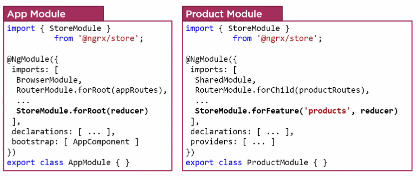
</p>

#### How to access a value in the store?
We have to select the appropiate slice of state.
```typescript
this.store.select('products');
// OR
this.store.pipe(select('products')).subscribe(products => {
  ...
});
```
<p align="center">
  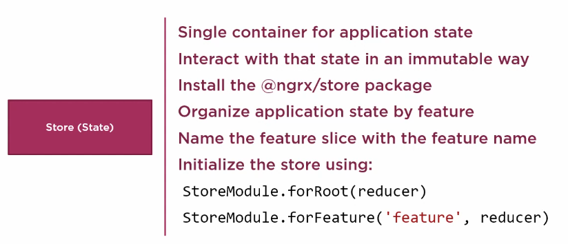
</p>
<p align="center">
  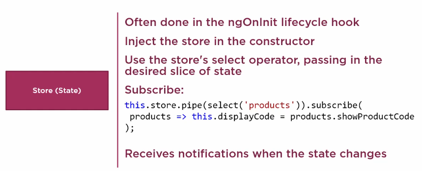
</p>

### Actions
All relevant user events are dispatched as actions, effecting reducers who update the store.
#### Examples
* Login action after a login form submission.
* Toggle side menu action after clicking a button.
* Retrieve data action when initializing a component.

Actions are basically simple JavaScript objects with a type as a string and an optional payload that can be of any type.
```javascript
{
  type: 'LOGIN',
  payload: {
    username: 'Cristian',
    password: 'secret'
  }
}
```
When we say the store is read-only and that to change state we dispatch actions, we mean you shouldn't mutate the state and you should follow the principle of immutability, meaning that if you need to change the state of the store, then replace the whole state object and not just mutate part of it. Immutability can bring increased performance to your apps and lead to simpler programming and debugging as data that never changes is much easier to reason about then data that is free to be changed arbitrarily throughout your app.

<p align="center">
  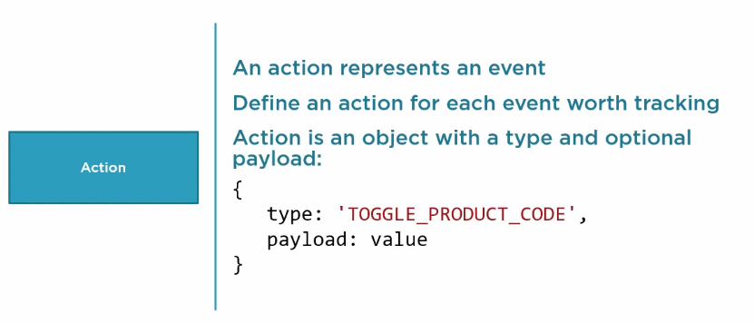
</p>
<p align="center">
  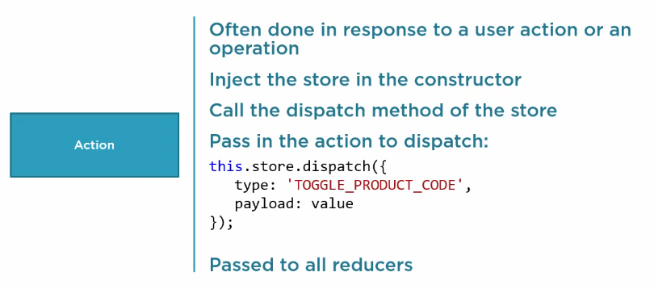
</p>

### Reducers
Reducers are functions that specify how state changes in response to an action. It is called whenever an action is dispatched.
#### Examples
* Set a userDetails state properly on login.
* Toggle a sideMenuVisible state property to true on a button click.
* Set successfully retrieved data on a component initialization.
* Set a globalSpinnerVisible property to true while saving data.

Not all dispatched actions can directly update the store via a reducer as some actions have **side effects**.
A reducer is a pure function, accepting two arguments. The previous state and an action dispatched to update state. Reducers use switch statements to listen and act on specific action types, taking the actions payload and state and returning new state. For each action, the reducer creates a new representation of the state and returns that new state to the store, replacing any prior state.
```javascript
function reducer(state, action) {
  switch (action.type) {
    case 'LOAD_USER':
      return { users: [...state.users, action.payload] };
  }
}
```
#### What is a pure function?
A pure function is a function, given the same arguments, will always return the same value with no observable side effects. So pure functions will always return consistent results, but also pure functions will not mutate or access properties outside of their function scope.

<p align="center">
  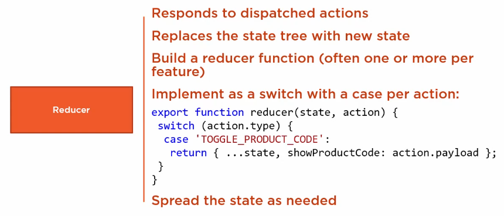
</p>

### Diagram
<p align="center">
  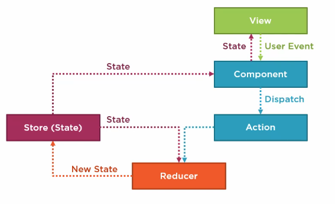
</p>

### Advantages of the Redux Pattern
* Centralized immutable state making it easier to track down problems. Using pure functions to change state allows features in Redux, like time travel debugging, record replay, and hot reloading. It also makes it easy to hydrate your application's state from local storage or when doing server-side rendering.
* Redux makes it easier to implement an Angular change detection strategy in your components called OnPush, which can improve your view performance.
* Makes writing unit tests easier. All of your state changes go through pure functions, which are much simpler to test.
* Tooling is another huge benefit of using the Redux pattern, as Redux makes it possible to have a history of state changes.
* Component communication. NgRx makes it easier to access to shared state via injecting the store into a component versus passing data between components.

> "Redux is not great for making simple things quickly. It's great for making really hard things simple."

## Redux Devtools
1. Download the Redux Devtools Extension.
2.
```bash
npm install @ngrx/store-devtools
```
3. In your AppModule add instrumentation to the module imports using StoreDevtoolsModule.instrument:
```typescript
import { StoreDevtoolsModule } from '@ngrx/store-devtools';
import { environment } from '../environments/environment'; // Angular CLI environment

@NgModule({
  imports: [
    StoreModule.forRoot(reducers),
    // Instrumentation must be imported after importing StoreModule (config is optional)
    StoreDevtoolsModule.instrument({
      maxAge: 25, // Retains last 25 states
      logOnly: environment.production, // Restrict extension to log-only mode
    }),
  ],
})
export class AppModule {}
```

## Defining Interfaces for Slices of State
For each slice of state we define an interface that describes the structure of that state. Then we pull it together to compose the global application state from each feature slice of state. This interface then defines our entire state tree, referencing each of the feature interfaces for detailed properties.
<p align="center">
  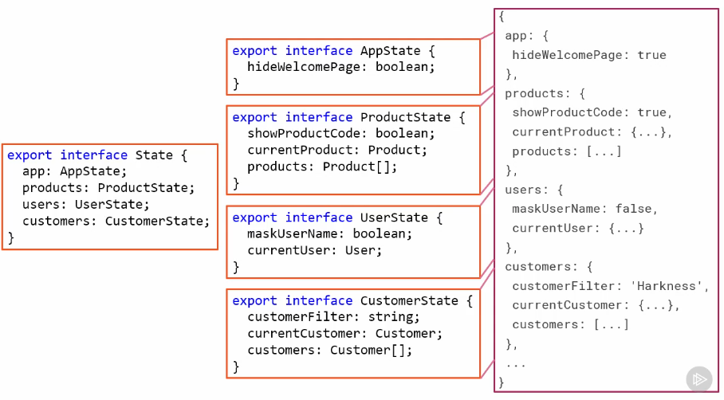
</p>

## Extending the State Interface for Lazy Loaded Features
When we set up a feature module for lazy loading, that module is independently bundled, and when the user accesses the application, it is downloaded from the server separate from our main application bundle, after the first page of the application is displayed. This improves our application's startup performance.
### So what does lazy loading have to do with our state interface?
We want to establish logical boundaries around our lazy loaded features. To maintain that boundary, we want to keep our lazy loaded feature areas completely separate from our initial bundled code. By directly importing the product state interface here, we break through that boundary.
<p align="center">
  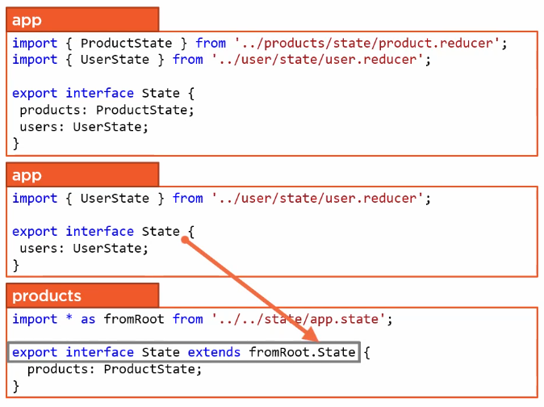
</p>

In this example, we'll instead define the interface only for the users slice of state, since it isn't lazy loaded. Then in the products feature code, we'll extend that definition of our global application state to include the product state. Since this code is part of the products feature, we keep it within our lazy loading boundary. Here we define a state interface that extends our global application state interface using the extends keyword. Instead of importing each individual interface from our app. state file, we import *, which imports all of the exported members. Extending the global application state results in a state interface that looks just like our original, but is defined to keep our lazy loading boundary intact. As we add features, if they aren't lazy loaded we'll add them to this state interface. Otherwise we'll use this technique and the associated feature to extend the state interface.

## Set Initial Values
Since one of the goals of using NgRx is to make our application more predictable, we should explicitly define initial values for each bit of state so that it is not undefined. One way to initialize our state is to define an object and set an initial value for each bit of state. To ensure the initial value is never changed, we declare it as a constant.
<p align="center">
  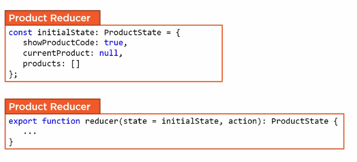
</p>
Here we define a constant named initialState and strongly type it using our ProductState interface. We then specify an initial value for each property. To assign this initial state, we take advantage of JavaScript's default functional parameter syntax. This syntax allows us to initialize a function parameter with a default value. Now when the store is initialized and the reducer is first called, these initial values are assigned and our store is never undefined.

## Selectors
So far our components subscribe to the store, selecting the entire products slice of state. There are a few issues with this approach.
1. Hardcoded string here that leaves us open to typographical and misspelling errors.
2. Explicitly retrieve a property from the store, making assumptions about the store structure. That means if we ever change the structure of our store, reorganizing it into sub-slices, we have to find every select and update its code.
3. Watches for changes to any property in the slice of state.

A selector is a reusable query of our store. It is basically like a stored procedure for accessing our in-memory state information. Selectors allow us to keep one copy of the state in the store, but project it into different shapes, making it easier to access by our components and services. Our components use the selector to select state from our store, adding a level of abstraction between our stores structure and our component.

### Benefits to using Selectors
<p align="center">
  
</p>
1. They provide a strongly typed API for the components to use. We don't have to refer to slices of state with hard coded strings.
2. They decouple the store from the components so the components don't need to know about the structure of the store. This allows us to reorganize or split up the state differently over time without updating every component that accesses it.
3. Selectors can encapsulate complex data transformations, making it easier for the components to obtain complex data.
4. They are reusable, so any component can access the same bit of state the same way.
5. Selectors are memoized, that's a fancy word meaning that the selectors returned value is cached and won't be reevaluated unless the state changes. This can improve performance.

### What is a Selector?
It is a function that drills into the store and returns a specific bit of state. There are two basic types of selector functions provided by the NgRx library (Both required).

The first type is a **createFeatureSelector**. This function allows us to get the feature slice of state simply by specifying its feature name. We strongly type the return value using the generic argument. Here we specify our products slice of state and assign this function to a constant. When executed, it selects the specific feature slice of state. We don't export this constant so it can only be used where it is defined.

The second type of selector function is a **createSelector**. This function allows us to get any bit of state by composing selectors to navigate down the state tree. Here we pass the feature selector function in as the first argument to this selector. The last argument is a projector function that takes in the state returned from the prior arguments, which in this case is the products slice. We can then filter, map, or otherwise process the state to return the desired value. We assign this function to an exported constant so we can use the selector from our components. By using selectors in our components, if our stores structure ever changes, we can modify these selectors to access that new structure without changing any of the components that use them.
<p align="center">
  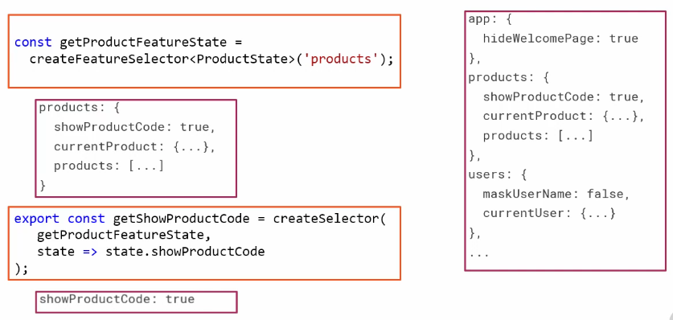
</p>

One important thing to note here, a selector should be a pure function. That is to say that given the same input, the function should always return the same output with no side effects.

<p align="center">
  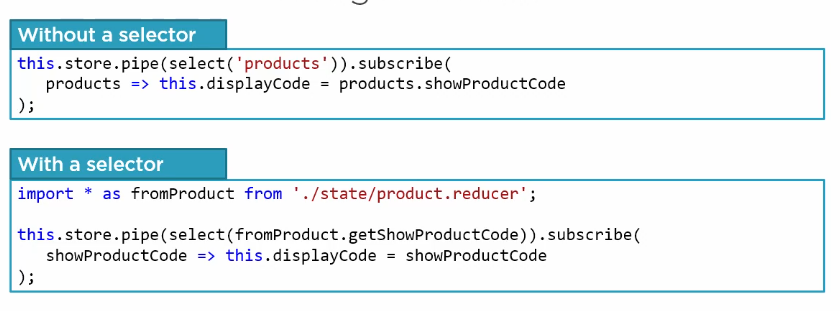
</p>

### Composing Selectors
<p align="center">
  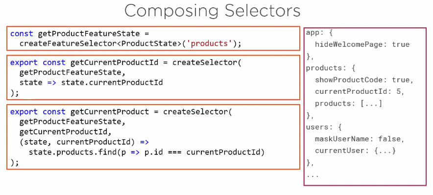
</p>

## Actions Creators
There are several ways to strongly type our actions, including action factory functions. But we'll take advantage of the extra type safety and build action creators. Strongly typing actions using action creators involves three steps:
1. Define the action types as a set of named constants.
2. Build the action creators.
3. Define a union type for those action creators.

### Benefits of Strongly Typed Actions
1. Strong typing helps prevent hard to find errors from misspellings or typos.
2. Strong typing improves the tooling experience, making it easy to see the list of actions and select the appropriate action for a given purpose, and it results in a well-defined set of valid actions that the application can perform.
3. This provides a level of documentation on what the application can do. So strong typing help us define a clear and clean set of actions that the tooling uses to help us better use those actions.

### Defining Action Types
Since action types are strings, we can define the set of valid action types using an enum. Using enums makes it easy to document intent, which is exactly what we want for our actions. This enum will ultimately provide the comprehensive list of all actions that can be performed against the product feature state. We could name it anything, but by convention we'll name it based on our feature, ProductActionTypes. We then clearly name each action type with an enum constant. The action constant name often begins with an action verb, such as **toggle, set, clear, initialize, or load**. We assign each action type name to an appropriate string.
```typescript
export enum ProductActionTypes {
  ToggleProductCode = '[Product] Toggle Product Code',
  SetCurrentProduct = '[Product] Set Current Product',
  ClearCurrentProduct = '[Product] Clear Current Product',
  InitializeCurrentProduct = '[Product] Initialize Current Product',
}
```
Here we begin each action string with the name of the slice of state that is effected by the action, then we specify the action type name, but with spaces to make it readily readable. You and your team may want to get more specific with these strings, including the name of the page or API that dispatches the action. You and your team may want to get more specific with these strings, including the name of the page or API that dispatches the action. That provides a better context of the event source and can make it even easier to use the DevTools to examine where the actions were dispatched.

### Building Actions Creators
The next step is to build an action creator for each action. An action creator expresses an action as a simple class with two properties, a type and a payload. It's called an **Action Creator** because we use it to literally create the actions we dispatch. Expressing actions as classes makes it possible to strongly type the actions when we dispatch and process them in the application.
 ```typescript
export class ToggleProductCode implements Action {
  readonly type = ProductActionTypes.ToggleProductCode;

  constructor(public payload: boolean){ }
}
```
By convention, we name the class the same name as the action type constant defined in the enum. To define the class as an action, we implement the Action interface provided by the NgRx store. Then we declare the two properties. We define the type property as readonly so it is never changed. We assign it to the associated enum constant. We define the payload property in the constructor. By specifying the accessibility here in the constructor, we take advantage of a TypeScript shortcut that declares a property and assigns that property in the constructor.

### Defining a Union Type for the Action Creators
The last step to strongly typing our actions is to define a type that unions all of the action creator classes. We do this so we can limit the possible actions to only those defined by one of these creator classes. To expose this union type to the other parts of the application, we export it. Then we give it a name based on our feature. We assign it to the union of our action creator classes, using the pipe character to union the classes into one consolidated type, one type to rule them all.
```typescript
export type ProductActions = ToggleProductCode
  | SetCurrentProduct
  | ClearCurrentProduct
  | InitializeCurrentProduct;
```

### Defining Actions for Complex Operations
<p align="center">
  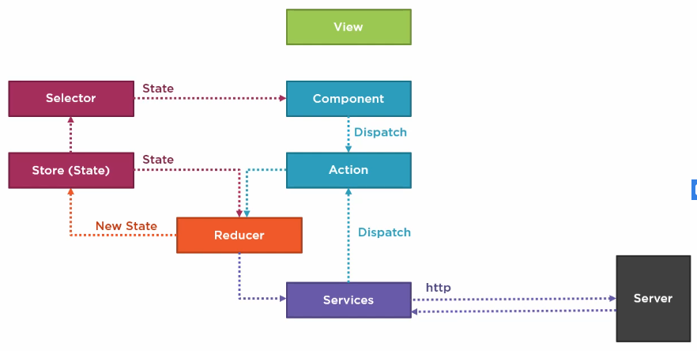
</p>

## Effects
Operations in our application may have side effects. In this context, a side effect is an operation that depends on or interacts with an external source, such as external state, devices, or an API. So using HTTP to access a backend server is an example of a side effect. Rather than having the logic to manage these side effects in your components, you can use NgRx's architecture to handle such code, to keep your components pure.

At first glance, we may look at our existing code and think we can simply inject the store and the services into the constructor, then dispatch an action after the service retrieves the products. But in NgRx components are not the best place to manage code with side effects, like our product services HTTP requests here, as we want to keep our components pure.
<p align="center">
  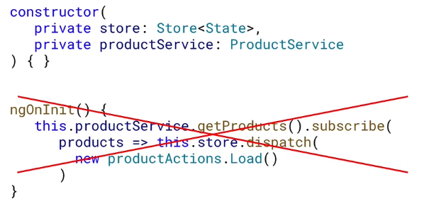
</p>
We do not want to handle side effects in reducers either, as their pure functions you can't modify state here in an async callback, in fact, you can't even dispatch actions from a reducer when you do get a response back because reducers are designed to be pure functions, not classes, so there's no constructor to inject the store into to be able to dispatch an action. We could get an instance of the store by other means, but it's not the reducer's role and it wouldn't be conventional, so this won't work and is a bad idea, and you break the purity of the store reducer.
<p align="center">
  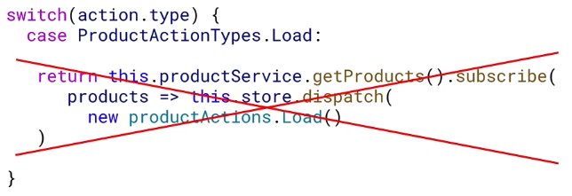
</p>

So the best place to side effects is in an **effect**, which work by taking in an action, doing some work, and dispatching a new action, often a success or a fail action.

### Example
<p align="center">
  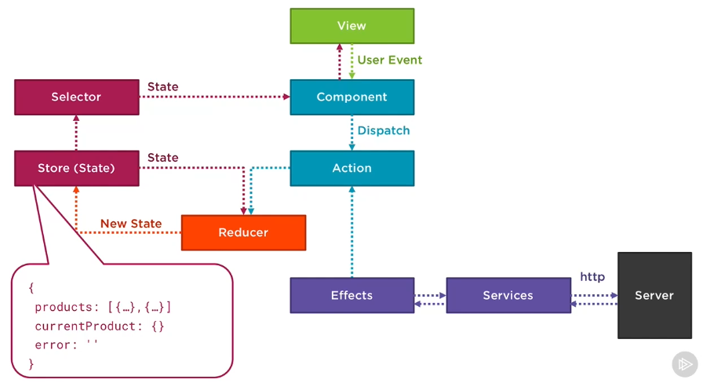
</p>
We will use effects to deal with the async side effect operation of fetching products from our server. The component dispatches an action on initialization with a type of load and no payload because we don't need to call our server with any parameters to get all products. We now have two places in our application we could be listening for this action, either in a reducer or an effect. In this case, it's our effect that we configure to listen for the load action after the action goes via the reducer. As we know, async requests have side effects and we can't do async work in our reducers. Remember, our effects job is to take in actions, do some work, and dispatch other actions. In this case, the work is getting the products from our server, so the effect talks with our Angular product service that makes a HTTP request to our server to get the products. If the server responds successfully then passes an array of products to the service, the service then passes the products to the effect that dispatches another action. This time a **LoadSuccess action** with the Products array as its payload. The reducer takes that action with the array of products and existing state to create new state with the added products. We can then use our get products selector to subscribe to state changes in our component and pass the Products array to the view.

### Benefits of Effects
1. Effects keep your components pure by removing the code that deals with side effects.
2. Effects help isolate side effects into a central place.
3. Effects make it easier to test side effects in isolation from the components that use them.

### Defining an Effect
An effect is a type of Angular service, so at its core it should just look like any other Angular service with that injectable decorator on top of a TypeScript class, except by convention, we'll call it ProductEffects.

In the constructor, we inject the Actions observable from the NgRx library, which emits an action every time one is dispatched in our application.
```typescript
@Injectable()
export class ProductEffects {
  //  Inject the ProductService to do the work of fetching our products from the server.
  // To listen to all actions in our application, we can use the actions$ observable we injected into our effects constructor.
  constructor(private productService: ProductService, private actions$: Actions) { }

  // Create an effect by making a variable and registering it with NgRx as an effect by adding an effect decorator on top of it.
  @Effect()
  loadProducts$ = this.actions$.pipe(
    // ofType operator and configuring it to listen for our Load action, which we can access from our ProductActionTypes enum in our productActions file
    ofType(ProductActionTypes.Load),
    // MergeMap maps over every emitted action calling Angular services who return observables, then merges these observables into a single stream
    mergeMap(action =>
      this.productService.getProducts().pipe(
        // Use another pipe with a map operator to map over the emitted products array and return a LoadSuccess action with the products as its payload.
        // Return a new action
        map(products => (new LoadSuccess(products)))
      )
    )
  )
}
```

### SwitchMap vs MergeMap
Often your effects will be about making HTTP requests that return observables. Depending on the operator you choose, you might cancel in-flight requests or make requests out of order if new actions are dispatched against the same effect. We used an RxJS merge map operator in our effect to map over our current actions observable and merge any inner observables returned from calling our Angular service into a single observable stream, which most of the time will likely be the operator you want, but not always. We could have used a switchMap operator. But choosing the wrong operator here can be a source of unexpected race conditions.

> switchMap: Cancel the current subscription/request and can cause race conditions.
> Use for get requests or cancelable requests like searches.

You'll use the switchMap operator least often in your effects because it cancels the current subscription if a new value is emitted. This means if someone dispatches, for example, a second save product action before the first save product action's HTTP request returns to your effect, the first in-flight HTTP request will be canceled and the product might not get saved, leading to potential race conditions. So use the switchMap operator for get requests or cancelable requests, like searches in a type ahead.

> concatMap: Runs subscriptions/requests in order and is less performant.

ConcatMap runs HTTP requests in order and will wait for the last request to finish before starting the next, which is less performant, but the safest. So use concatMap for get, post, and put requests when order is important.

> mergeMap: Runs subscription/requests in parallel.
> Use for put, post and delete methods when order is not important.

MergeMap runs HTTP requests in parallel and is more performant than concatMap, but doesn't guarantee order. So you use mergeMap for put, post, and delete methods when the order is not important.

> exhaustMap: Ignores all subsequent subscription/requests until it completes.
> Use for login when you do not want more requests until the initial one is complete.

ExhaustMap will ignore all subsequent actions dispatched until the current request completes. Use exhaustMap, for example, during logins when you do not want to make or queue up anymore requests until the initial one is complete.

### Registering an Effect
Initializing the effects library in an application is similar to initializing the store, but rather than passing in reducers, we pass in an array of effects. We will lazily load product effects when we load our Module.
```typescript
@NgModule({
  imports: [
    ...
    StoreModule.forFeature('products', reducer),
    EffectModule.forFeature([ProductEffects])
  ],
  declarations: [...],
  providers: [...]
})
export class ProductModule{ }
```

### Exception Handling in Effects
To listen for errors, we can use another operator called catchError. If our productService returns an error, we can get a hold of it here and return a LoadFail action with a payload of the error. The catchError operator does not automatically return an observable back into the stream, like our map operator, so we can use the observable of to create an observable from our LoadFail action and return that.
```typescript
@Effect()
loadProducts$ = this.actions$.pipe(
  ofType(ProductActionTypes.Load),
  mergeMap(action =>
    this.productService.getProducts().pipe(
      map(products => (new LoadSuccess(products))),
      catchError(err => of(new LoadFail(err)))
    )
  )
)
```

## Unsubscribing from Observables
To avoid a creating a possible memory leak by not unsubscribing, let's use a common unsubscribe strategy in Angular, which is to use the takeWhile operator. We want to keep subscribing to this store and take while our component is still active. To do this, let's initialize a property called **componentActive** to true at the top of our component, then in an Angular ngOnDestory lifecycle hook, which will be fired when the component is destroyed, we can change this variable to false. This allows us to say take while or keep subscribing until the component is destroyed.
```typescript
export class ProductListComponent implements OnInit, OnDestroy {
  componentActive = true;

  ngOnInit() {
    this.store.pipe(select(fromProduct.getProducts),
      takeWhile(() => this.componentActive))
      .subscribe((products: Product[]) => this.products = products);
  }

  ngOnDestroy() {
    componentActive = false;
  }
}
```
You may be looking at that is a pain to have to add this unsubscribe code to every piece of state I subscribe to. This is where Angular's async pipe can help, as it automatically subscribes and unsubscribes to observables for you. In our Product List Component, rather than subscribe to the product state, we can leave it as an observable of product and use it to initialize a product$ variable to use in our template. In the Product List View, we use the async pipe to subscribe to the product$ observable and pass the emitted products to the ngFor. The beauty of this approach is now Angular will handle the subscribing and unsubscribing automatically for you.

```typescript
this.products$ = this.store.pipe(select(fromProduct.getProducts));
```
```typescript
*ngFor="let product of products$ | async"
```

### When should you use the Async Pipe vs Subscribing?
Subscribe in the component when you need the observable's value in the component class, so to work with it or to change the value before using it in the template. If you do not need to do anything but subscribe and use the value in the template, then it's much easier to use an async pipe. If you don't need the value in the component, then technically it's just a syntactic difference and it's up to you which you'd prefer, as long as you unsubscribe. When using NgRx you have a lot of small pieces of state to subscribe to and our code is a lot easier to read with async pipes.

```html
<div *ngIf="products$ | async as products">
  <div *ngFor="let product of products">{{product.name}}</div>
</div>
```

We can also use the async pipe with an ng if using the as syntax, that allows us to subscribe and set a local template reference to the value of the observable. Add the async pipe using the products$ observable and using an as products syntax to set a local variable we can use inside of the template. This can be extremely handy for these scenarios where we want to hide the HTML until we get a value from the observable.

## Architectural Considerations

### Folder by Feature or Function
If we had structured our state folders by function, we would have needed to taken out all of the state folders contents and moved it, along with all other state, into one main state folder and then now would be following the by function approach, and this is not the recommended way. The benefits of having your state folders by feature versus function are:
1. Follows the Angular style guide's recommendations to organize your code by feature versus function.
2. Makes it easier for a developer to locate and identify what each file does at a glance.
3. as your app grows, it stops it from becoming cluttered.

### Container Presentational Component Pattern
A benefit of NgRx is that it takes a lot of logic out of your components and moves it into NgRx's effects, reducers, and Angular services. This makes it easier to move towards a presentation or container component pattern, which is a way to divide components into two categories. Well before going into the characteristics of each category, it's important to note, it's more a mindset than a rigid classification. You still need to be pragmatic, making components that sometimes will have both characteristics.

#### Presentational Components
Presentational components are concerned with how things look.
2. They're about the HTML markup and specific CSS styles to render your views.
3. They have no dependencies on the rest of your app, such as injected services or the store.
4. They don't specify how the data is loaded or changed, but they emit events via @Outputs to trigger container components to do the work.
5. They receive data exclusively via Angular @Inputs.
6. May contain both presentational and container components as their children.

It's not a strict requirement that presentational components only have other presentational components underneath them. Some examples of presentational components would be nav menus, sidebars, user info panels, and many list type components.

#### Container Components
Container components are concerned with how things work.
1. Render little to no HTML markup and specific CSS styles.
2. They do have dependencies on the rest of your app, such as injected services or the store.
3. They're stateful and can specify how the data is loaded or changed.
4. They are often top level routes you navigate to. It's very common to have all of your routes load container components that have a tree of mostly presentational components underneath them.
5. They may also contain both presentational and container components underneath them.

<p align="center">
  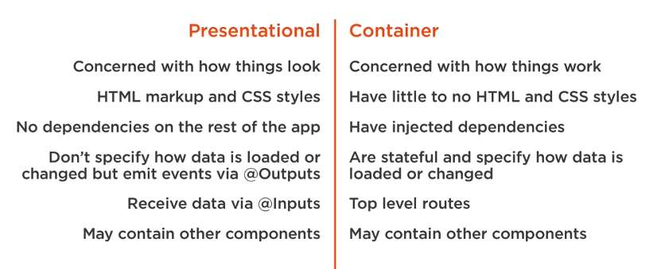
</p>

#### Performance
The performance is a key benefit of following this pattern by utilizing Angular's change detection strategy called OnPush. OnPush allows skipping change detection on presentational components whose @Inputs have not changed.

#### Composability
Composing pages of presentational components that are less tightly coupled makes it easier to reuse them while also understanding your UI and app a lot better. Imagine we wanted to use our product list component to render either a list of products, available products, products on sale, or even a list of products based on a search filter. The first time we wanted to show a different list, we would have to start adding more logic to the product list component and making it more brittle, and this would go on and on for each new scenario. Instead, we could make a presentational component so it doesn't know how to get the filtered data or what to do when a product is selected, except emit an event, which makes it a lot easier to reuse this component.

#### Easier to test
Presentational components are much easier to test with no injected dependencies or services to mock and spy presentational components, usually pure components who always return the same result for the same inputs, also making it simpler to know what to test in your components.

Container components also become simpler to test as you separate the concern of getting data with rendering the view.

### Application Architecture
Let's separate out our product show component and our product list component into a container component and a presentational component.

The first step in following the presentational container component pattern is to separate the different component categories into folders, adding the product-list and product-edit components as presentational components under a folder called components and the product-shell component in a folder called containers.

<p align="center">
  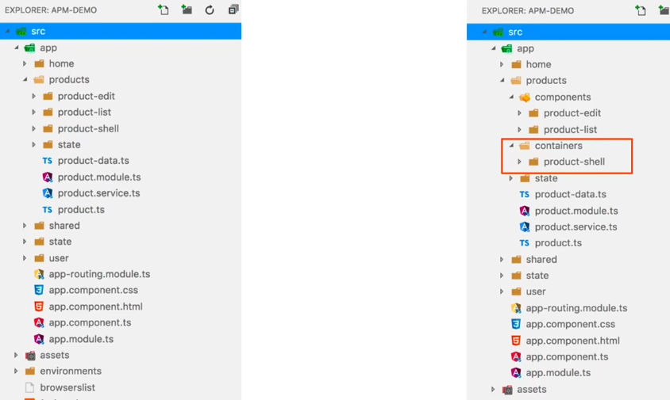
</p>

Our product shell component at the moment is truly a shell with no logic or injected dependencies, it's just a container for our product list component. The product list component, however, can become a presentational component if we move the injected store dependency, which is used for selecting multiple pieces of state and to dispatch multiple actions.

<p align="center">
  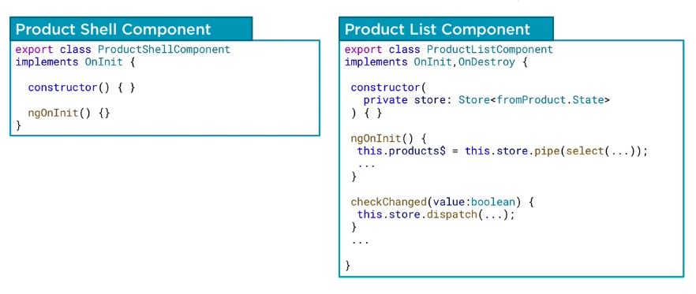
</p>

Moving all this logic over to the product shell component means now our product list component doesn't know or care how to get its data, it just knows it will be passed data via @Inputs. Any changes to the state or that are external to the component, will be delegated to the container component via @Output EventEmitters, for example selecting a product to edit or setting the state property's show product code flag to true. The components still has methods, but all they do is listen for button clicks and emit events. The component no longer needs a constructor and becomes a pure component, which is very simple to rationalize about and reuse.

<p align="center">
  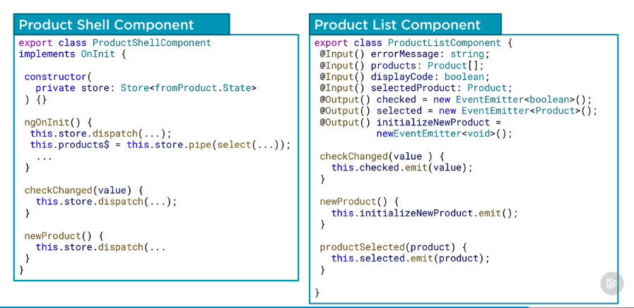
</p>

The presentational product list component sitting on the template of our product shell component, may now look more complicated, needing to pass all of these properties and events. However, following this pattern, it becomes normal to pass multiple pieces of data into the component and to listen for multiple events being passed out.

<p align="center">
  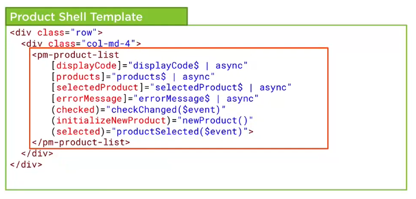
</p>

### Change Detection OnPush
Following the presentational container component pattern allows us to more easily take advantage of an Angular change detection strategy called OnPush to optimize our view performance. Reading the Angular API documentation for ChangeDetectionStrategy OnPush, it says that change detector's mode will be initial set to CheckOnce.

#### What does this mean for our performance?
Basically this strategy tells Angular that a component depends solely on @Inputs and only needs to be checked if it receives a new input reference or if the component or its children trigger a DOM event, like a button click. When I say input reference, I mean that in order to trigger change detection in our component, we need to change the input object reference, not just mutate it (This is another example of how dealing with immutable store data with NgRx can help us take advantage of more advanced patterns).

<p align="center">
  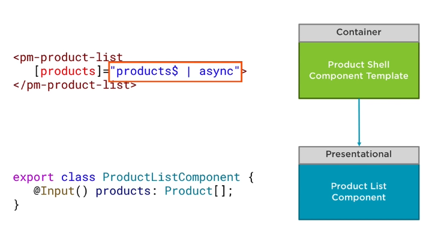
</p>

It's important to note any asynchronous API events, like XHR or promise-based events, will not trigger change detection once you change to this strategy of OnPush and the components template will not get updated.

#### Angular uses ChangeDetectionStretagy by Default
The default strategy doesn't assume anything about the application, therefore every time changes in your application as a result of any user events, timers, XHR requests, promises, etc, change detection will run on all components. This means anything from a click event to a data received from an HTTP call, causes change detection to be triggered, potentially causing performance issues in your application as it checks every component.

The OnPush ChangeDetection strategy will skip change detection unless the components inputs receive a new value or object reference. TO use it, add ChangeDetectionStrategy. OnPush to the component's decorators ChangeDetection property. It's easier to use this when categorizing components into presentational or container components.

#### Example
The way Angular's change detection system works is that if a button click, for example, occurs down here at the bottom of the tree, it will trigger a round of change detection. Angular's change detection starts at the top at its root component and goes down the component tree, checking every component, even if it has not changed.

<p align="center">
  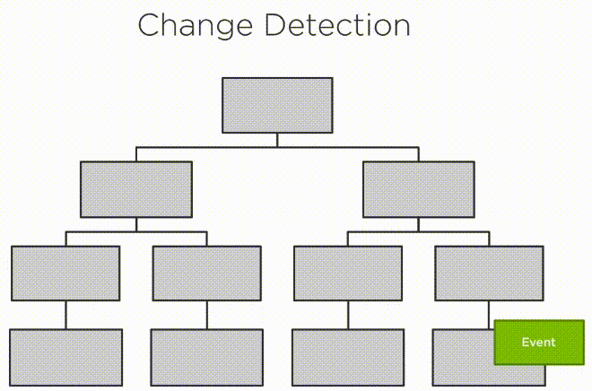
</p>

In contrast, if a button click occurs again, but this time we change this component's change detection strategy to OnPush, Angular will still run around a change detection starting at the root component and working its way down the component tree, however, the component marked with OnPush and all of its children will be skipped. This can make a real world difference in an application with a lot of components loaded with thousands of potential expressions to be checked every time a button is clicked.

<p align="center">
  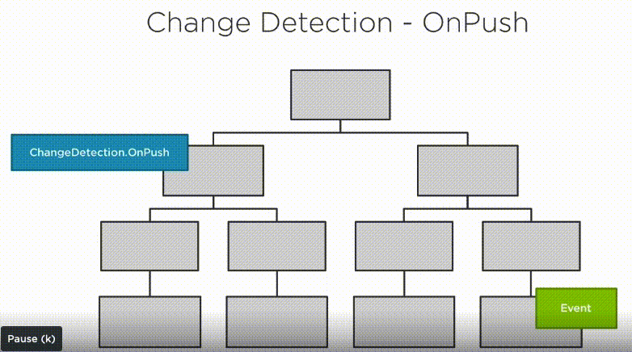
</p>

Using this strategy with the presentational container pattern is pretty simple. On all your container components, you change their ChangeDetectionStrategy to OnPush. This is done in the component's app component decorator. By default the ChangeDetectionStrategy is set to default.

```typescript
import { Component, OnInit, ChangeDetectionStrategy } from '@angular/core';

@Component({
  templateUrl: '...',
  styleUrl: '...',
  changeDetection: ChangeDetectionStrategy.OnPush
})

export class ProductShellComponent implements OnInit { }
```

Remember that now unless a new input reference is passed or a DOM event is raised in your component or its children, the view will not get updated.

### Summary of the State, Actions and Effect
<p align="center">
  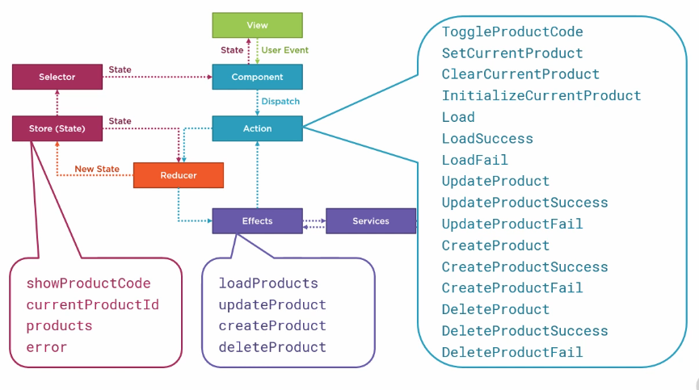
</p>

## Additional NgRx Libraries

### @ngrx/entity
Most Angular applications manage entities, such as products. As we've seen in this course, there is quite a bit of code required to build the actions and reducers for our entity, Create, Read, Update and Delete, or CRUD, operations.

NgRx entity is the library that provides helper functions for managing collections of entities and building the actions, reducers, and selectors, minimizing the boilerplate for CRUD operations.

Use NgRx entity anytime you want to reduce the amount of code required to manage entities in your NgRx application.

### @ngrx/schematics
Schematics are a scaffolding library provided as part of the Angular CLI. If you've ever used ng new or ng generate, you've seen how the CLI uses schematics to generate code. You and your team can build your own schematics to change how the CLI generates code or add more specific code generation specifications.

The NgRx schematics library is a set of schematics specifically for generating NgRx code using the Angular CLI. You can generate the code to set up the application with a store. You can generate actions, reducers, and effects, and NgRx schematics has blueprints for generating code for feature modules, container components, and NgRx entities.

### @ngrx/router-store
Angular's routing helps us move the user from one view of the application to another. We can connect the Angular router to the store using NgRx router store. This library dispatches router navigation actions so we can process them like any other actions in the application.

### ngrx-data
Instead of helping us with NgRx by generating code, the ngrx-data library takes a different approach and instead abstracts it all away. With a little configuration, and by following a few conventions, ngrx-data handles the rest, but only for our entities. It does not handle any other type of application state. With ngrx-data, when working with entities, we don't need to create actions or action creators. No reducers, no selectors, no effects, and no code generation. Instead, we define some metadata, register the appropriate module, and everything else is handled in the ngrx-data library, and it offers extension points for customization as needed.

Use this library if you want the benefits of NgRx for your entity but don't want to write any of the code. But note that this also means you are giving up some control for how NgRx works with your entities in your application.
