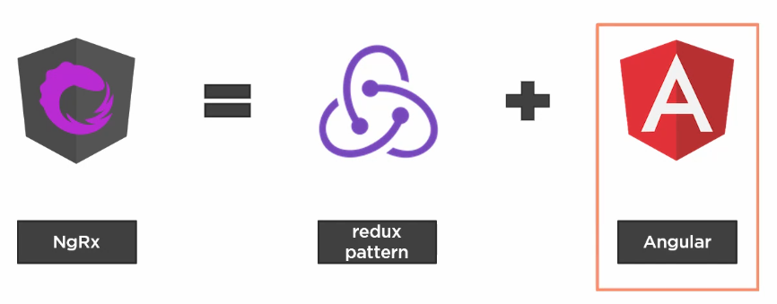

# NgRx
Every Angular application needs to manage state. As an application gets larger, it must manage more and more state. Keeping track of that state can be challenging, especially as more components must react to state changes. We often end up with fragile interactions and hard to find bugs, making it difficult to add more features and more state.

## What is state?
<p align="center">
  
</p>

## Purpose of NgRx
The purpose of NgRx is to provide a formal pattern for organizing our application's state into one single, local state container, managing that state by requiring a one-way data flow, and communicating state changes to our components so they can react accordingly.

## What is NgRx?
NgRx is the popular state management pattern called Redux tailored to Angular using standard Angular concepts and techniques.
<p align="center">
  
</p>

## Why use NgRx?
With NgRx we don't need a service for each bit of state, rather we have a single store for our application state, making it easy to find, track, and retrieve state values.

## Use NgRx when...
### There is lots of state and little services.
The store provides a convenient place to put UI state to retain it between router views.
### There are excessive HTTP requests.
The store provides a client-side cache our application can use as needed.
### There are complex component interactions.
The reducer updates the store and the store notifies all subscribers, keeping the components decoupled, yet communicating. Using NRx in this scenario can prevent race conditions and issues caused when multiple components are updating data.
### Something isn't working
It has great tooling to help us see our actions and state. Using NgRx gives us a standard pattern that can help large or complex projects and larger teams with these issues. But NgRx is not for every project.

## Don't use NgRx when...
* Your team are new to Angular, wrap up with Angular and RxJS Observables first. You'll be much more successful with NgRx once you've mastered Angular.
* If the application is simple, the extra code required for NgRx may not be worth the effort for a simple application.
* If you and your team already have a good state management pattern in place for your applications.

## The Redux Pattern
 Patterns bring order to chaos, and the Redux pattern is no different. Redux is a way to implement a predictable state container for JavaScript apps. Redux the library, which was the first to implement the Redux pattern, was based on Facebook's Flux library, and in the last few years has become the dominant state management pattern for single-page applications. The Redux pattern, which NgRx is based on, has three main principles.

 > There is only one single source of truth for application state called the store.
 > State is ready-only and the only way to change state is to dispatch an action.
 > Changes to the store are made using pure functions called reducers.

### Store
The store is literally a JavaScript object that holds all of your application state. You can think of it as a client-side database. With Angular, you may be building services to hold your application state. Following the Redux pattern, all of this state instead is retained in the store. This becomes very powerful when it comes to reasoning about user interaction, debugging, performances, and avoiding race conditions in general.
#### Do you have to put every piece of state in the store? What shouldn't go in the store?
* Unshared state that is solely owned by a single component that does not need to be shared or made available across routes.
* Angular forms also don't belong in the store as they are usually self contained and do not need to be shared across multiple components. Also, Angular forms are not serializable or immutable and can change themselves, meaning you will not be able to track those changes with actions, which is the second principle of Redux, that to change state you need to dispatch actions.
* State that has cycles in it or has complex data structures that cannot be serialized should not be put into the store.

### Actions
All relevant user events are dispatched as actions, effecting reducers who update the store.
#### Examples
* Login action after a login form submission.
* Toggle side menu action after clicking a button.
* Retrieve data action when initializing a component.

Actions are basically simple JavaScript objects with a type as a string and an optional payload that can be of any type.
```javascript
{
  type: 'LOGIN',
  payload: {
    username: 'Cristian',
    password: 'secret'
  }
}
```
When we say the store is read-only and that to change state we dispatch actions, we mean you shouldn't mutate the state and you should follow the principle of immutability, meaning that if you need to change the state of the store, then replace the whole state object and not just mutate part of it. Immutability can bring increased performance to your apps and lead to simpler programming and debugging as data that never changes is much easier to reason about then data that is free to be changed arbitrarily throughout your app.

### Reducers
Reducers are functions that specify how state changes in response to an action.
#### Examples
* Set a userDetails state properly on login.
* Toggle a sideMenuVisible state property to true on a button click.
* Set successfully retrieved data on a component initialization.
* Set a globalSpinnerVisible property to true while saving data.

Not all dispatched actions can directly update the store via a reducer as some actions have **side effects**.
A reducer is a pure function, accepting two arguments. The previous state and an action dispatched to update state. Reducers use switch statements to listen and act on specific action types, taking the actions payload and state and returning new state.
```javascript
function reducer(state, action) {
  switch (action.type) {
    case 'LOAD_USER':
      return { users: [...state.users, action.payload] };
  }
}
```
### What is a pure function?
A pure function is a function, given the same arguments, will always return the same value with no observable side effects. So pure functions will always return consistent results, but also pure functions will not mutate or access properties outside of their function scope.

## Advantages of the Redux Pattern
* Centralized immutable state making it easier to track down problems. Using pure functions to change state allows features in Redux, like time travel debugging, record replay, and hot reloading. It also makes it easy to hydrate your application's state from local storage or when doing server-side rendering.
* Redux makes it easier to implement an Angular change detection strategy in your components called OnPush, which can improve your view performance.
* Makes writing unit tests easier. All of your state changes go through pure functions, which are much simpler to test.
* Tooling is another huge benefit of using the Redux pattern, as Redux makes it possible to have a history of state changes.
* Component communication. NgRx makes it easier to access to shared state via injecting the store into a component versus passing data between components.

> "Redux is not great for making simple things quickly. It's great for making really hard things simple."
